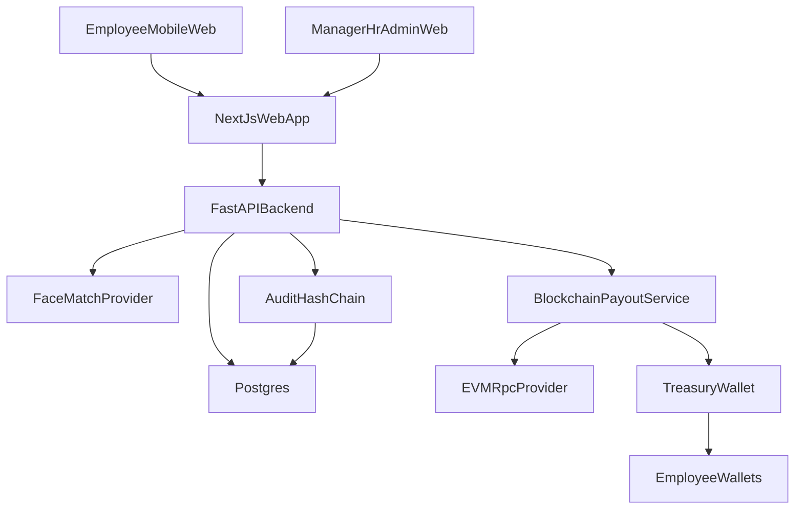
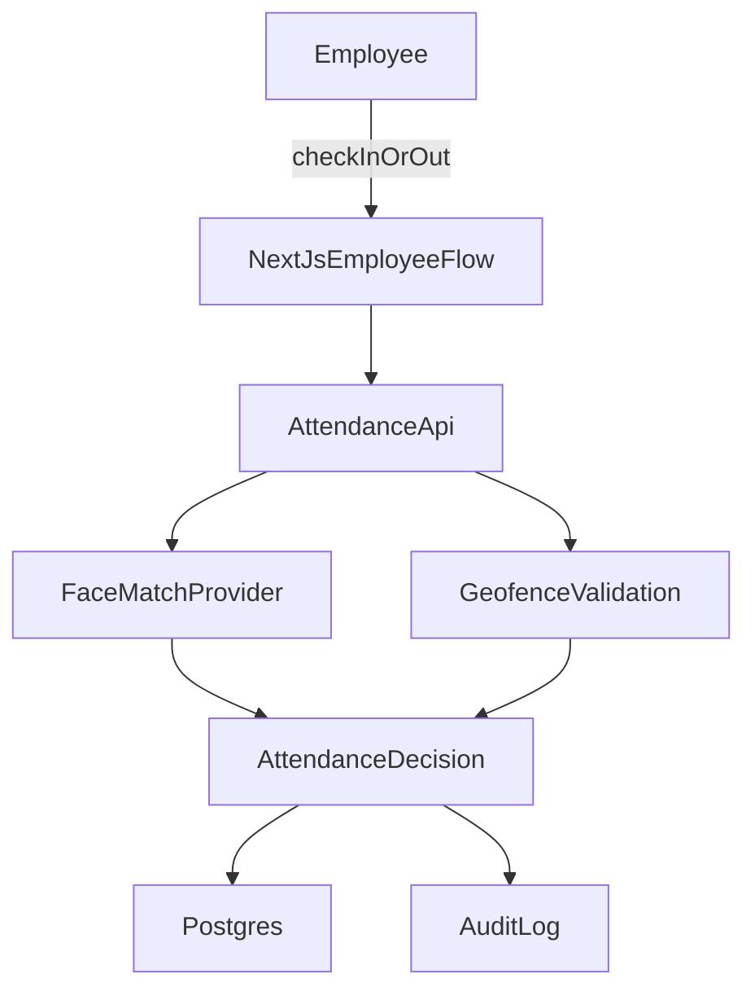
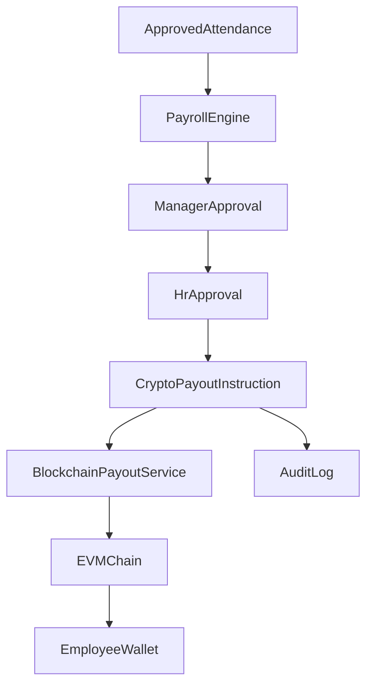
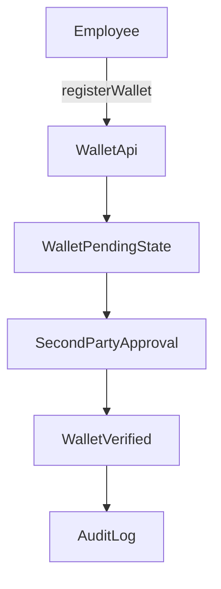
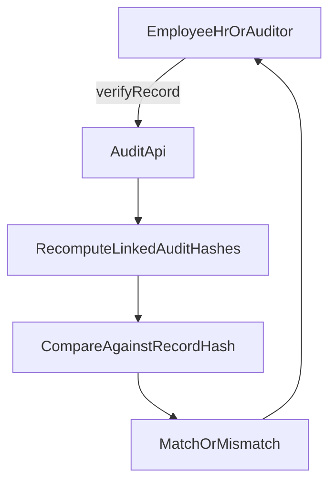

# Orgx MVP Architecture

## 1. Architecture Goals

The Orgx MVP architecture should:

- support one pilot company while remaining tenant-ready
- provide a mobile-first employee experience and web dashboards for business roles
- keep attendance, payroll, payout, and audit logic in a central backend
- support wallet-based crypto disbursement on `EVM`
- preserve a tamper-evident audit trail for critical events
- let authorized users verify attendance and payroll record integrity

## 2. High-Level System

## 3. Primary Components

### Next.js Web App

One `Next.js` application should serve:

- employee mobile-first attendance screens
- manager attendance and approval screens
- HR approval and payout screens
- company admin setup screens
- audit and reporting views

Recommended route group split:

- employee
- manager
- hr
- admin

### FastAPI Backend

One `FastAPI` service should own:

- authentication and authorization
- company and employee data
- attendance validation orchestration
- payroll computation
- approval workflow
- payout execution orchestration
- audit log creation and verification

Recommended modules:

- `auth`
- `companies`
- `users`
- `employees`
- `consent`
- `locations`
- `attendance`
- `approvals`
- `payroll`
- `payments`
- `audit`

### Postgres

`Postgres` is the source of truth for all operational state and audit records. It stores canonical records for:

- tenants and users
- employee and location metadata
- employee consent records
- attendance attempts and accepted events
- payroll periods, runs, and line items
- approval actions
- payout instructions and blockchain status tracking
- audit chain records

### Face Match Provider

An external biometric service should compare live capture input to the employee's enrolled reference. The backend should treat this as an integration behind a provider interface, not as core logic mixed into controllers. Face enrollment should not proceed unless a recorded consent event already exists for the employee.

### Blockchain Payout Service

This service layer is responsible for:

- building payout instructions
- validating supported chain and token rules
- preparing on-chain transfers
- submitting or relaying transactions
- tracking transaction state

For the MVP, the chain service should target one `EVM` network and a limited token allowlist.

## 4. Data And Control Flow

### Attendance Flow

### Payroll And Payout Flow

### Wallet Verification Flow

### Record Verification Flow

## 5. Trust Boundaries

### Trusted Core

The trusted core is the Orgx backend plus the database. These components decide:

- who can access which records
- whether attendance is accepted or rejected
- whether approvals are sufficient
- whether payout execution can start
- whether wallet verification is sufficient for payout eligibility

### Semi-Trusted Integrations

External providers return signals or outcomes, but Orgx remains responsible for business decisions. These integrations include:

- face-match provider
- `EVM` RPC provider
- wallet transaction relay or signing infrastructure

### User-Controlled Edge

Employees control:

- their device
- their browser session
- their wallet
- their later fiat conversion choices

Orgx should not assume the device or wallet environment is fully trusted, so wallet state and transaction confirmations must be verified from backend-observed blockchain signals where possible.

## 6. Security And Operational Assumptions

- all backend endpoints require authenticated access unless explicitly public
- every business record includes `company_id`
- every privileged action must be permission-checked server side
- payout execution must be idempotent at the payroll-item boundary so one payroll item cannot be paid more than once
- wallet verification requires a two-party approval flow
- on-chain transaction submission must be traceable with internal request identifiers
- employee wallet changes should be guarded, auditable, and unable to retroactively repoint an already-generated payroll item

## 7. Privacy And Compliance Considerations

- face and GPS data should follow a defined retention policy and only keep what is required for verification and audit
- consent for biometric and location collection should be recorded before enrollment or capture flows depend on it
- biometric processing through an external provider must be contractually and technically reviewed before rollout
- wallet payout policy and supported tokens must be reviewed against the operating region's payroll and crypto rules
- Orgx should not perform fiat conversion inside the MVP; employees convert externally after receipt
- offboarding should include a defined retention or deletion path for biometric reference and consent records

## 8. Deployment Assumptions

The MVP can start with a simple deployment model:

- one `Next.js` deployment
- one `FastAPI` deployment
- one managed `Postgres` instance
- one secure secret store for API keys and treasury credentials

This keeps the operational footprint small while still leaving space for modular scaling later.

## 9. Integration Assumptions

### Face Verification

The MVP should integrate with one face-match provider. Orgx stores enrollment status and reference metadata, but provider-specific logic must stay behind an internal abstraction.

### Wallet And Chain

The MVP should support:

- employee registration of an `EVM` wallet address
- wallet verification through a two-party approval flow
- one payout chain
- a short approved token allowlist
- transaction status tracking with retry lineage back to the original instruction

The employee uses their own wallet and later converts crypto externally. Orgx does not act as an exchange in the MVP.

## 10. Recommended Technical Boundaries

Keep the following boundaries explicit in code and docs:

- UI does not contain payroll decision logic
- payout submission does not bypass approval checks, including wallet verification
- audit creation is part of service-layer operations, not optional UI behavior
- blockchain integration is a provider/service concern, not spread across business modules
- retry of a failed payout is an explicit, attributed action rather than an automatic silent resubmission

## 11. Open Architecture Decisions To Verify Later

- which `EVM` chain is the official first chain
- which payout token or token set is supported initially
- whether payout signing uses a direct treasury wallet, relay service, or contract-based distributor
- who the designated second approver is for wallet verification in the first rollout
- whether optional public-chain audit anchoring stays separate from payout-chain activity
