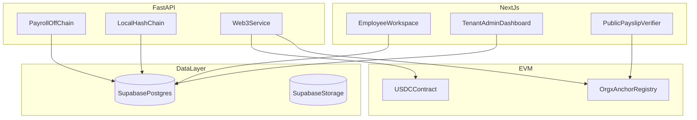

# Orgx Blockchain Integration (MVP)

This document defines the focused blockchain scope for Orgx. It aligns with the hybrid trust model: operational data in `Postgres` and `Supabase Storage`, with blockchain used only for payout value and proof references—not raw media or full attendance payloads.

## MVP Blockchain Scope

Only these three capabilities belong in the first blockchain slice:

1. **Salary transaction record** — real stablecoin payout via standard ERC-20 transfer from the Orgx treasury wallet to the employee wallet, with `tx_hash` stored in `Postgres`.
2. **Digital payslip verification** — SHA-256 hash of the generated payslip PDF registered on-chain so anyone can verify a payslip was issued by Orgx.
3. **Attendance and audit proof** — hash-chained audit log in `Postgres`, with periodic root hashes anchored on-chain to detect database tampering.

Everything else stays off-chain in `FastAPI`:

- tenant provisioning
- approvals
- payroll rules
- attendance validation
- remote work-proof review

## Architecture: Focused Hybrid Model

## Smart Contract: `OrgxAnchor`

Payroll logic does **not** live in a smart contract. Payouts are direct ERC-20 transfers (`USDC` / `USDT`) from the treasury wallet.

`OrgxAnchor` is a minimal **hash registry** contract:

- `anchorAttendance(companyId, merkleRoot)` — daily or periodic attendance root per tenant
- `anchorAudit(companyId, auditRoot)` — periodic audit-chain root per tenant
- `registerPayslip(pdfHash)` — payslip PDF hash registration

Contract functions are `onlyOwner` (Orgx backend signer). Tenant identity on-chain should use a stable numeric `company_id` mapped from the internal tenant record, not raw UUID strings.

Planned location: `contracts/OrgxAnchor.sol`

Target network for MVP: Polygon Amoy (testnet), stablecoin-first.

## Backend Responsibilities

### `apps/api/app/services/blockchain.py`

- execute ERC-20 payout transfers
- persist `BlockchainTransaction` rows
- run periodic anchoring job:
  - build Merkle root from attendance events for a period
  - submit attendance root to `OrgxAnchor`
  - submit latest audit-chain root to `OrgxAnchor`

### `apps/api/app/services/payslip.py` (Phase after payout works)

- generate payslip PDF
- store PDF in `Supabase Storage`
- compute SHA-256 hash
- call `registerPayslip` on `OrgxAnchor`

### Config (extend `.env.example`)

- `ORGX_ANCHOR_CONTRACT_ADDRESS`
- `USDC_TOKEN_ADDRESS`
- `TREASURY_PRIVATE_KEY` (secured; never committed)
- existing `EVM_RPC_URL`, `EVM_CHAIN_ID`

## Frontend

- `{tenant}.orgx.com` — employee workflow; show payout `tx_hash` and verification status where relevant
- `orgx.com` (org dashboard) — approvals and payroll review for company admins
- `orgx.com/verify` — public payslip hash verification (queries `OrgxAnchor.payslipHashes`)

## What Stays Off-Chain

- face images and remote work-proof photos (`Supabase Storage`)
- attendance rows and validation results (`Postgres`)
- manager and HR approval workflows (`Postgres` + audit log)
- Firebase Auth identity

## Build Timing

Do **not** start blockchain work before:

1. org can sign up, pay, and get `{tenant}.orgx.com` provisioned
2. employee attendance flow works off-chain
3. payroll approval flow works off-chain

Recommended blockchain order:

1. ERC-20 payout + `tx_hash` tracking (Phase 6 in roadmap)
2. local audit hash-chain verification (already in core product)
3. `OrgxAnchor` deployment + periodic root anchoring (Phase 7)
4. payslip hash registration + public verify page (post-MVP or late MVP)

## Verification Plan

### Automated

- pytest with mocked Web3 for payout and anchoring
- Hardhat tests for `OrgxAnchor` owner restrictions

### Manual (testnet)

- deploy `OrgxAnchor` on Polygon Amoy
- run mock payroll payout; confirm transfer on explorer
- generate payslip, register hash, verify via `/verify`
- tamper with PDF and confirm verification fails

## Risks To Track

- treasury key custody and rotation
- gas wallet balance monitoring
- mapping internal tenant IDs to on-chain `companyId`
- payslip PDF is a nice trust feature but not required to prove the core tenant + employee loop
